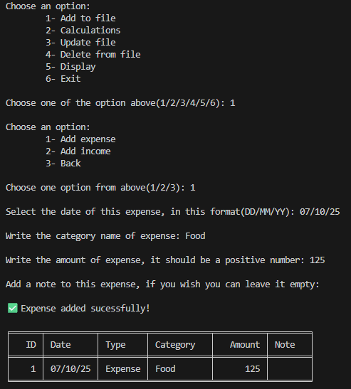
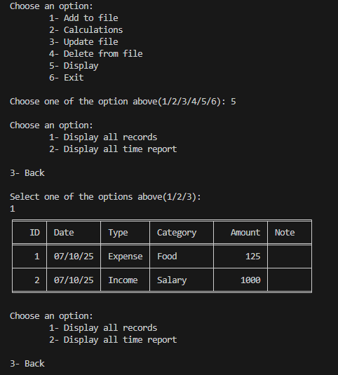
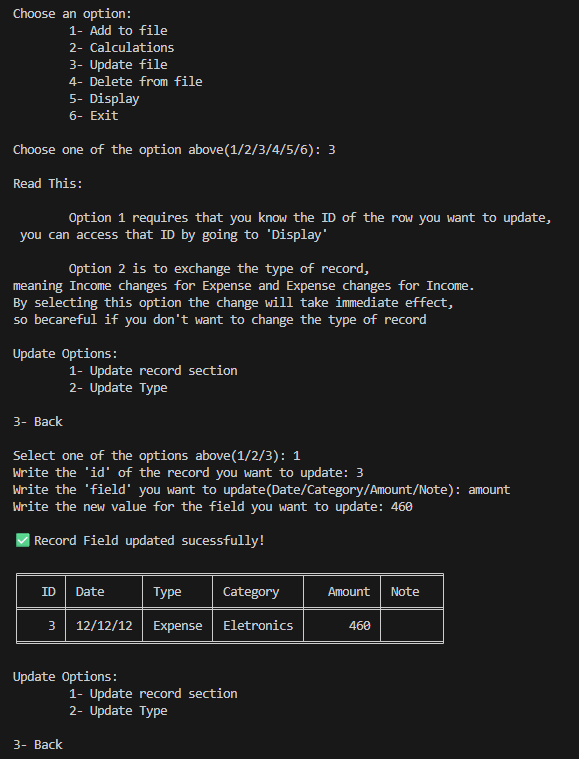
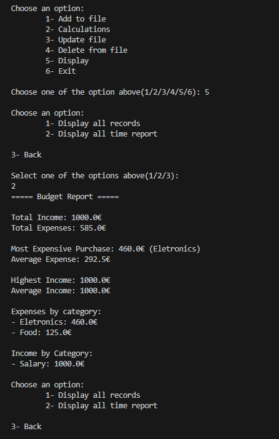

# Budget Tracker

A simple Python terminal application to track expenses and income, calculate budgets, and generate summary reports. Ideal for personal use and learning purposes.

## Features

- Add expenses (date, amount, category, optional note)
- Add income (date, amount, category, optional note)
- View all records
- Calculate total expenses and income
- Calculate expenses and income per category
- Calculate minimum, maximum, and average expenses and income
- Export and store data in CSV files

## Tech Stack

- Python 3.x
- Pandas (for data handling)
- Tabulate (for formatted terminal tables)
- CSV files (for storage)

## Setup

1. Clone the repository:

```bash
git clone https://github.com/ivo372/budget-tracker.git
cd budget-tracker
```

2. Create and activate a virtual environment (recommended):

```bash
python -m venv .venv
source .venv/bin/activate  # Linux/Mac
.venv\Scripts\activate     # Windows
```

3. Install dependencies:

```bash
pip install -r requirements.txt
```

4. Run program:

```bash
python3 budget/main.py
```

## Example Usage

- Adding an expense:



- Viewing all records:



- Updating record:



- Print Report:



Screenshots are examples, outputs may vary depending on the data entered.


## Notes

- This project is developed incrementally; features and documentation are updated as development progresses.

- Designed for small-scale personal or family budget tracking.